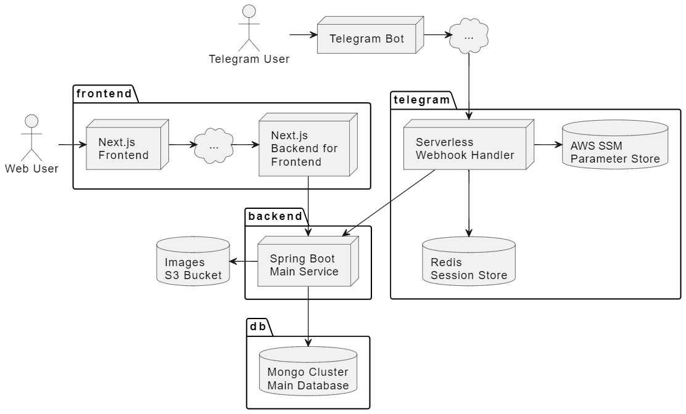

# TP TACS 2024-C1 - Compra Conjunta (Grupo 1)

El objetivo del TP es desarrollar una aplicación que sirva para realizar una
compra de un producto entre varias personas.
[Ver enunciado](https://docs.google.com/document/d/e/2PACX-1vRg7hKBnJ80MhyYrISjxbkf13QVZpInt-D6Fgg32tB_BTJwxDdVVlg3PjHW6Qzv-AlopUPsJDJoajPy/pub)

Es posible acceder a través del
[sitio web](https://tacs-compra-conjunta.vercel.app/) o el
[bot de Telegram](https://web.telegram.org/k/#@TACSCompraConjuntaBot).

## Tecnologías

- Backend: Java 21, Spring Boot 3.2.4, Maven 3
- Frontend: Node 18, Next.js 14.2.3 w/React 18
- Telegram: Serverless Framework 4.1.6
- Bases de Datos: MongoDB 7.0 y Upstash (Redis)



## Cómo correr la aplicación en local

### S3

Para correr un s3 bucket en local, se puede utilizar la imagen de MinIO que se
encuentra en el archivo `compose.yml`:

```bash
docker compose up -d s3
```

Luego, se puede acceder a la consola de MinIO en http://localhost:9001/ con las
credenciales configuradas en el archivo `.env`.

### Backend

El backend depende de contar con ambos base de datos y s3 corriendo en local,
por lo que es necesario levantar ambos servicios con:

```sh
docker compose up -d mongo s3
```

Ahora sí, para correr la aplicación en local se debe ejecutar el método main de
la clase `Grupo1Application`. Y con esto ya vamos a tener el backend corriendo
en http://localhost:8080/

Dicho backend se puede probar a través de la colección de Postman que se
encuentra en la carpeta `docs` del proyecto.

### Frontend

El frontend depende del backend, la base de datos y el s3 para correr en local:

```bash
docker compose up -d mongo s3 backend
```

Una vez hecho esto, simplemente ejecutamos el comando:

```bash
npm run dev
```

Y ya vamos a tener la aplicación corriendo en http://localhost:3000/

## Cómo correr la aplicación completa con Docker

El proyecto cuenta con un archivo `compose.yml` que permite correr la
aplicación en varios contenedores de Docker, uno para el backend, otro para el
backend-for-frontend, uno para la base de datos y otro para el s3 bucket.

Para correr la aplicación, primero hay que configurar las variables de entorno
creando un archivo `.env` en la raíz del proyecto basándose en el archivo
`env.example`.

Luego, simplemente debemos ejecutar el siguiente comando en el directorio raíz
del proyecto:

```bash
docker compose up
```

Una vez que la aplicación esté corriendo, se podrá corroborar que el backend
está funcionando correctamente accediendo a http://localhost:8080/health

Además, dicho healthcheck se encuentra configurado en el docker compose file
para esperar a que el backend esté listo antes de levantar el frontend, el cual
se puede acceder en http://localhost:3000/

### Dockerfile

Los archivos `Dockerfile` se encuentran en la raíz de ambos proyectos (frontend
y backend) y contienen las instrucciones necesarias para construir las imágenes
de docker de ambas aplicaciones.

En la primera capa del `Dockerfile` se utilizan las dependencias de desarrollo
para poder construir la aplicación.

Luego, en la segunda capa, se utilizan únicamente las dependencias de ejecución
además de los archivos generados en la capa anterior. Esta capa corre la
aplicación en modo no-root, para evitar problemas de seguridad.

## Despliegue

### DigitalOcean Container Registry

Para automatizar el despliegue del backend, contamos con una GitHub Action
para construir y subir la imagen de Docker a DigitalOcean Container Registry.

Es necesario proveer las siguientes variables antes de ejecutar el pipeline:
- `registry`: Nombre del registry de DigitalOcean
- `token`: API Token de DigitalOcean

### Cloudflare R2

En segundo lugar, debemos contar con un R2 Object Storage creado y extraer
la siguiente información:
- Account ID y Bucket Name: que servirán para construir la URL hacia el
  bucket.
- Access Key ID y Secret Access Key: ambos servirán para conectarse al bucket
  utilizando la API de AWS S3 (la cual es compatible con Cloudflare R2).
- Public Domain: dominio público para acceder a las imágenes guardadas en el
  bucket desde Internet. Podemos generar un **R2.dev subdomain** de forma
  gratuita a modo de prueba.

### Terraform

Para desplegar la aplicación en los distintos proveedores cloud, se utilizó
Terraform. Los directorios `db`, `backend` y `frontend` contienen los módulos
necesarios para desplegar la base de datos, el backend y el frontend
respectivamente.

**Lo único que se necesita desplegar a mano es el Cloudflare R2, el cual se
debe configurar manualmente en la consola de Cloudflare.**

Para desplegar la aplicación en cada uno de los proveedores primero vamos a
configurar todas las variables definidas en el archivo `variables.tf`. Para
ello, podemos elegir una de las siguientes dos opciones:

1. Guardarlas en un archivo `terraform.tfvars` dentro de la raíz del
   repositorio, basándonos en el archivo `example.tfvars`.
2. Configurar variables de entorno agregando el prefijo `TF_VAR_` a cada
   variable, por ejemplo: `var.example` -> `TF_VAR_example`.

Una vez configuradas todas las variables listadas, vamos a inicializar
Terraform:

```bash
terraform init
```

Por último, vamos a aplicar los cambios:

```bash
terraform apply
```

Terraform nos imprimirá todos los recursos que serán creados, y una vez
ingresemos `yes` los creará y guardará su estado en un archivo
`terraform.tfstate`. Este archivo tiene información sensible en texto
plano, por lo que **no debe ser pusheado al repositorio**.

#### Terraform Destroy

En caso de que queramos destruir la infraestructura, simplemente debemos
ejecutar el siguiente comando:

```bash
terraform destroy
```

Y en base al contenido de `terraform.tfstate` eliminará todos los recursos que
tengamos levantados.

### Telegram Bot

Por último, el Bot de Telegram es un webhook que se despliega a través de la
CLI de Serverless Framework. Las instrucciones están en la carpeta
[telegram](./telegram).

El bot consume el backend y las credenciales SSM desplegadas previamente con
Terraform, por lo que no es necesario agregar ninguna configuración adicional.

## Integrantes

| Apellido y Nombre | GitHub                                               |
|-------------------|------------------------------------------------------|
| Álvarez, Damián   | [@Damuchi99](https://github.com/Damuchi99)           |
| Galli, Patricio   | [@Patricio-Galli](https://github.com/Patricio-Galli) |
| Lingeri, Martín   | [@MartinLingeri](https://github.com/MartinLingeri)   |
| Pesce, Franco     | [@fpesce27](https://github.com/fpesce27)             |
| Ranieri, Agustín  | [@RaniAgus](https://github.com/RaniAgus)             |

Nota: 10
